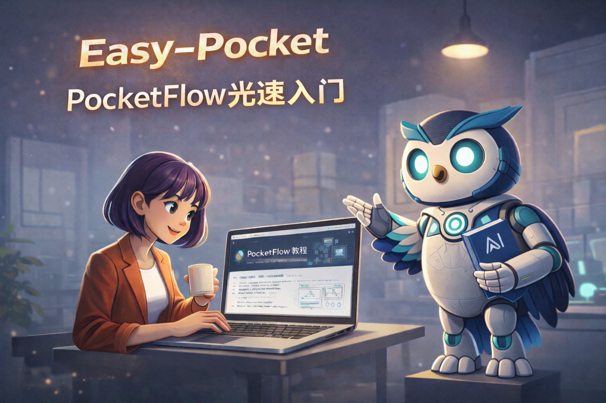
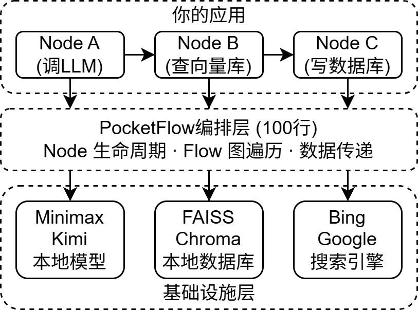

<div align="center">



```text
           ███████╗ █████╗ ███████╗██╗   ██╗    ██████╗  ██████╗  ██████╗██╗  ██╗███████╗████████╗
           ██╔════╝██╔══██╗██╔════╝╚██╗ ██╔╝    ██╔══██╗██╔═══██╗██╔════╝██║ ██╔╝██╔════╝╚══██╔══╝
           █████╗  ███████║███████╗ ╚████╔╝     ██████╔╝██║   ██║██║     █████╔╝ █████╗     ██║   
           ██╔══╝  ██╔══██║╚════██║  ╚██╔╝      ██╔═══╝ ██║   ██║██║     ██╔═██╗ ██╔══╝     ██║   
           ███████╗██║  ██║███████╗   ██║       ██║     ╚██████╔╝╚██████╗██║  ██╗███████╗   ██║   
           ╚══════╝╚═╝  ╚═╝╚══════╝   ╚═╝       ╚═╝      ╚═════╝  ╚═════╝╚═╝  ╚═╝╚══════╝   ╚═╝
```

# Easy-Pocket : 从零掌握 PocketFlow（⚠️ Alpha内测版）

> [!CAUTION]
> ⚠️ Alpha内测版本警告：此为早期内部构建版本，尚不完整且可能存在错误，欢迎大家提Issue反馈问题或建议。

<p align="center">
  <a href="https://github.com/The-Pocket/PocketFlow">PocketFlow 官方仓库</a> ·
  <a href="#内容导航">内容导航</a> ·
  <a href="#如何学习">如何学习</a>
</p>

<p align="center">
    <a href="https://github.com/datawhalechina/easy-pocket/stargazers" target="_blank">
        </a>
    <a href="https://github.com/datawhalechina/easy-pocket/network/members" target="_blank">
        </a>
    <a href="LICENSE" target="_blank">
        </a>
</p>

</div>

> **100 行代码，零依赖，构建 LLM 应用的一切。**

[PocketFlow](https://github.com/The-Pocket/PocketFlow) 是一个仅 100 行 Python 代码的极简 LLM 应用框架。它用 **Node**（节点）和 **Flow**（流程）两个核心抽象，让你可以构建聊天机器人、RAG、智能体、工作流等所有主流 LLM 应用。

**Easy-Pocket** 是 PocketFlow 的**交互式中文教程**，通过可视化演示和实战案例，带你从零理解框架原理、掌握应用开发。

## 🧩 PocketFlow 是什么？

PocketFlow 是一个**纯编排框架**（Orchestration Framework）—— 它只负责**调度节点、管理流程、传递数据**，不包含任何 LLM 调用、Embedding 计算或向量存储的实现。

<div align="center"></div>

*基于 PocketFlow 构建的应用架构*

| | PocketFlow 负责 | 你来决定 |
| :--- | :--- | :--- |
| **LLM** | 节点何时被调用、按什么顺序 | 用哪家 API（OpenAI / Claude / 本地模型） |
| **Embedding** | 批量处理的并行调度 | 用哪个模型和向量数据库 |
| **Memory** | shared 字典的读写传递 | 怎么持久化（文件 / Redis / 数据库） |
| **工具调用** | 智能体 循环的执行与分支 | 调用哪些外部 API 和工具 |

> **一句话定位**：PocketFlow = 图的运行时。你把具体实现填进 Node 的 `exec()` 方法，PocketFlow 负责把它们串成流程。

如果你学过编译原理或形式语言，会发现 PocketFlow 的执行模型就是一台**有限状态自动机**（Finite State Automaton, FSA）：

| FSA 形式定义 | PocketFlow 对应 |
| :--- | :--- |
| 状态集 Q | Node 集合 |
| 字母表 Σ | Action 字符串集（`"continue"`、`"retry"`、`"done"` …） |
| 转移函数 δ(q, a) | `node - "action" >> next_node` |
| 初始状态 q₀ | `Flow(start=node)` |
| 终止 | `post()` 返回的 action 无后继节点 → 流程结束 |

不同 LLM 应用模式，对应不同的自动机拓扑：聊天机器人是带自环的单状态机，智能体 是有分支+环的自动机，结构化输出是带回退边的自动机。详见[原理篇 §2.4](docs/zh-cn/pocketflow-intro/index.md)。

## ⚖️ 与其他编排框架的对比

理解了 PocketFlow 的定位后，我们可以将它与同一层级的编排框架进行对比。这些框架都解决"如何组织 LLM 调用"的问题，但设计哲学截然不同：

> 其他框架给你**预制组件**（智能体 类、RAG 管道、Memory 模块），你在框架规定的结构里填写逻辑。
>
> PocketFlow 给你**图论原语**（Node + Flow），你用这两块积木**自己搭建**一切。

| 框架 | 核心思路 | 代码量 | 依赖 | 厂商锁定 |
| :--- | :--- | :--- | :--- | :--- |
| **[PocketFlow](https://github.com/The-Pocket/PocketFlow)** | 最小有向图运行时：Node + Flow | **100 行** | **0** | **无** |
| [Agno](https://github.com/agno-agi/agno) | 声明式 智能体，内置 Memory / Knowledge | 数千行 | 少 | 低 |
| [AutoGen](https://github.com/microsoft/autogen) | Actor 模型，智能体 间异步消息传递 | 数万行 | 中 | 低-中 |
| [CrewAI](https://github.com/crewAIInc/crewAI) | 角色扮演团队，Manager 分配 Task | 数万行 | 中 | 低 |
| [LangGraph](https://github.com/langchain-ai/langgraph) | 有状态状态机 + 持久化检查点 | 数万行 | 多（LangChain 生态） | 中 |
| [OpenAI Agents SDK](https://github.com/openai/openai-agents-python) | 轻量 智能体 + Handoff + Guardrails | 数千行 | 少 | 中（OpenAI 优先） |
| [PydanticAI](https://github.com/pydantic/pydantic-ai) | 类型安全的函数调用 + Pydantic 验证 | 数千行 | 少 | 很低 |
| [SmolAgents](https://github.com/huggingface/smolagents) | LLM 生成 Python 代码而非 JSON tool call | ~1000 行 | 少 | 很低 |

PocketFlow 没有 `AgentExecutor`、`RetrievalChain`、`CrewManager` 这样的专用类 —— 所有模式都是同一套 Node + Flow 的不同图拓扑（见上方 [FSA 映射](#pocketflow-是什么)）。

## 🗺️ 内容导航

本教程分为三大板块，覆盖原理、实战与知识参考：

### 原理篇：PocketFlow 核心解析

| 章节 | 关键内容 |
| :--- | :--- |
| [引言：为什么需要 LLM 框架](docs/zh-cn/pocketflow-intro/index.md) | 核心痛点与框架对比 |
| [快速上手](docs/zh-cn/pocketflow-intro/quickstart.md) | 环境搭建、安装、第一个 Flow |
| [核心抽象：Node 与 Flow](docs/zh-cn/pocketflow-intro/core-abstractions.md) | 三阶段模型、图执行引擎、操作符重载、FSA 形式化视角 |
| [通信机制与设计模式](docs/zh-cn/pocketflow-intro/communication-and-patterns.md) | Shared Store + Params + 六大设计模式 |
| [深入源码](docs/zh-cn/pocketflow-intro/source-code.md) | BaseNode、Node、Flow、BatchNode、BatchFlow、AsyncNode |
| [工具函数与开发范式](docs/zh-cn/pocketflow-intro/tools-and-dev.md) | 工具函数分类、Agentic Coding、名词速查表 |

### 案例篇：从入门到进阶

| # | 案例 | 模式 | 难度 |
| :--- | :--- | :--- | :--- |
| 1 | [聊天机器人](docs/zh-cn/pocketflow-cases/beginner.md) | 链式 + 循环 | 入门 |
| 2 | [写作工作流](docs/zh-cn/pocketflow-cases/beginner.md) | 链式 | 入门 |
| 3 | [RAG 检索增强](docs/zh-cn/pocketflow-cases/beginner.md) | 链式 + BatchNode | 入门 |
| 4 | [搜索智能体](docs/zh-cn/pocketflow-cases/agents.md) | 循环 + 条件分支 | 中级 |
| 5 | [多智能体协作](docs/zh-cn/pocketflow-cases/agents.md) | AsyncNode + 消息队列 | 中级 |
| 6 | [Map-Reduce 批处理](docs/zh-cn/pocketflow-cases/batch-and-parallel.md) | BatchNode | 入门 |
| 7 | [并行处理 (8x 加速)](docs/zh-cn/pocketflow-cases/batch-and-parallel.md) | AsyncParallelBatchNode | 中级 |
| 8 | [结构化输出](docs/zh-cn/pocketflow-cases/output-quality.md) | 循环 + 重试 + 校验 | 中级 |
| 9 | [思维链推理](docs/zh-cn/pocketflow-cases/output-quality.md) | 循环 + 自检 | 进阶 |
| 10 | [MCP 工具集成](docs/zh-cn/pocketflow-cases/advanced-agents.md) | 智能体 + 工具 | 进阶 |
| 11 | [智能体技能](docs/zh-cn/pocketflow-cases/advanced-agents.md) | 链式 + 条件路由 | 中级 |
| 12 | [智能体编程](docs/zh-cn/pocketflow-cases/agentic-coding.md) | 完整项目模板 | 进阶 |

### 附录：软件工程知识参考

> 来自 Datawhale [Easy-Vibe](https://github.com/datawhalechina/easy-vibe) 项目，涵盖九大领域基础知识。学习过程中遇到不熟悉的概念时可随时查阅。

| 领域 | 关键主题 |
| :--- | :--- |
| 计算机基础 | CPU、操作系统、数据编码、网络、数据结构与算法 |
| 开发工具 | IDE、命令行、Git、环境变量、包管理器、调试 |
| 浏览器与前端 | JavaScript/TypeScript、前端框架、渲染管线、状态管理 |
| 服务器与后端 | HTTP 协议、Web 框架、API 设计、认证授权、并发模式 |
| 数据 | 数据库基础、数据模型、数据分析、A/B 测试 |
| 架构与系统设计 | 单体到微服务、分布式系统、高可用设计 |
| 基础设施与运维 | Linux、Docker、CI/CD、DNS/HTTPS、云平台 |
| 人工智能 | AI 发展史、Transformer、LLM、Prompt 工程、RAG、AI Agent |
| 工程素养 | 代码质量、测试策略、设计模式、安全意识、开源协作 |

## 📖 如何学习

<div align="center"></div>

根据你的背景选择学习路径：

- **零基础**：原理篇全篇 → 案例篇（聊天机器人 → 写作工作流 → RAG）
- **想做智能体**：原理篇 → 案例篇（搜索智能体 → 多智能体 → 智能体技能 → MCP → 智能体编程）
- **关注性能**：原理篇（BatchNode / AsyncNode）→ 案例篇（Map-Reduce → 并行处理）
- **输出质量**：原理篇（循环/重试）→ 案例篇（结构化输出 → 思维链推理）

## 💻 示例代码

每篇教程都附带**完整可运行**的 Python 示例，无需 API 密钥，开箱即用。

### 快速开始

```bash
# 1. 确认 Python 版本（需要 3.9+）
python --version

# 2. 创建虚拟环境
python -m venv .venv
# Windows:
.venv\Scripts\activate
# macOS / Linux:
source .venv/bin/activate

# 3. 安装依赖
pip install pocketflow
```

### 示例文件夹

| 教程 | 示例目录 | 内容 |
| :--- | :--- | :--- |
| 原理入门 | [`docs/zh-cn/pocketflow-intro/examples/`](https://github.com/datawhalechina/easy-pocket/tree/main/docs/zh-cn/pocketflow-intro/examples) | 10 个脚本：Node 生命周期、Flow 图执行、条件分支、批处理、异步并发等 |
| 应用案例 | [`docs/zh-cn/pocketflow-cases/examples/`](https://github.com/datawhalechina/easy-pocket/tree/main/docs/zh-cn/pocketflow-cases/examples) | 12 个案例：ChatBot、写作工作流、RAG、智能体、多智能体、Map-Reduce、结构化输出、MCP、智能体技能 等 |

> 所有示例使用模拟 LLM 实现，聚焦框架核心概念。如需接入真实 API，参见各目录下的 README 说明。

## 🖥️ 本地预览文档

```bash
npm install
npm run dev
# 打开 http://localhost:5173/easy-pocket/zh-cn/
```

## 📁 项目结构

```
easy-pocket/
├── docs/
│   ├── .vitepress/              # VitePress 配置 + 自定义主题
│   │   └── theme/
│   │       ├── Layout.vue       # 自定义布局（打字机效果）
│   │       ├── custom.css       # 全局样式
│   │       └── components/      # Vue 组件（门户页、打字机等）
│   ├── public/                  # 静态资源
│   └── zh-cn/
│       ├── index.md             # 门户首页
│       ├── pocketflow-intro/    # 原理入门教程（6 页）
│       │   ├── index.md         #   引言：为什么需要 LLM 框架
│       │   ├── quickstart.md    #   快速上手
│       │   ├── core-abstractions.md  #   核心抽象：Node 与 Flow
│       │   ├── communication-and-patterns.md  #   通信机制与设计模式
│       │   ├── source-code.md   #   深入源码
│       │   ├── tools-and-dev.md #   工具函数与开发范式
│       │   └── examples/        #   10 个配套示例脚本
│       ├── pocketflow-cases/    # 应用案例教程（7 页）
│       │   ├── index.md         #   案例地图与学习路径
│       │   ├── beginner.md      #   入门：聊天机器人 / 写作 / RAG
│       │   ├── agents.md        #   智能体：搜索 / 多智能体
│       │   ├── batch-and-parallel.md  #   批处理与并行
│       │   ├── output-quality.md     #   输出质量：结构化 / 思维链
│       │   ├── advanced-agents.md    #   高级智能体：MCP / 技能
│       │   ├── agentic-coding.md     #   智能体编程
│       │   └── examples/        #   12 个配套案例脚本 + 项目模板
│       └── appendix/            # 附录（索引页，链接至 Easy-Vibe）
│           └── index.md
├── package.json
└── README.md
```

## 👥 编委会

| 职责 | 名单 |
| :---: | :---: |
| **主编** | [@赵志民](https://github.com/zhimin-z) |
| **编委** | 欢迎 [提 Pull Request](https://github.com/datawhalechina/easy-pocket/pulls) 参与贡献 |

## 🌟 贡献者名单

| 姓名 | 职责 | 简介 |
| :--- | :--- | :--- |
| [@赵志民](https://github.com/zhimin-z) | 主编 | - |

*欢迎更多贡献者加入*

## 🤝 参与贡献

- 发现问题或有改进建议？欢迎 [提 Issue](https://github.com/datawhalechina/easy-pocket/issues)
- 想参与内容贡献？欢迎 [提 Pull Request](https://github.com/datawhalechina/easy-pocket/pulls)
- 内容贡献请遵循现有的写作风格和文件组织方式

## 💬 交流群

<div align="center">
<p>欢迎加入 Easy-Pocket 交流群，与其他开发者一起探讨学习：</p>

</div>

## 📧 关注我们

<div align="center">
<p>扫描下方二维码关注公众号：Datawhale</p>

</div>

## 🙏 致谢

- [PocketFlow](https://github.com/The-Pocket/PocketFlow) — 100 行极简 LLM 框架
- [Easy-Vibe](https://github.com/datawhalechina/easy-vibe) — 附录知识参考来源 & 门户页设计参考

## 📄 LICENSE

<a rel="license" href="http://creativecommons.org/licenses/by-nc-sa/4.0/">
  
</a>
<br />
本作品采用
<a rel="license" href="http://creativecommons.org/licenses/by-nc-sa/4.0/">
  知识共享署名-非商业性使用-相同方式共享 4.0 国际许可协议
</a>
进行许可。

<div align="center">
  <h3>⭐ 如果这个项目对你有帮助，请给我们一个 Star ❤️</h3>
</div>
