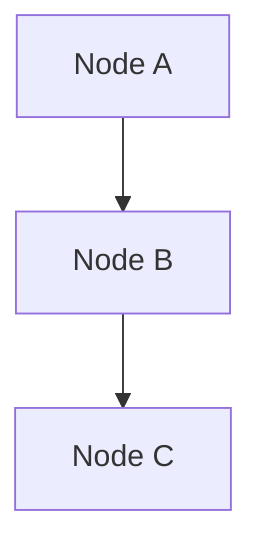

# 12. 智能体编程（Agentic Coding）

::: info 难度：进阶 | 模式：人类设计 + 代理实现 | 关键词：系统设计、数据契约、可靠性
:::

智能体编程是一种高效协作范式：**人类负责系统设计，AI 负责实现**。PocketFlow 的核心抽象（Node / Flow / Shared Store）让这种协作更自然。

<div align="center"></div>

*智能体编程：人类设计架构，AI 实现代码*

::: warning 重要提醒
如果你正在用 AI 构建 LLM 系统，请务必牢记三件事：
1）从**小而简单**的方案开始；2）**先写高层设计文档**（例如 `docs/design.md`）再写代码；3）频繁向人类确认与复盘。
:::

> **官方指南**：[Agentic Coding: Humans Design, Agents Code](https://the-pocket.github.io/PocketFlow/guide.html#agentic-coding-humans-design-agents-code)

### 12.1 分工原则（谁负责什么）

| 步骤 | 人类参与度 | AI 参与度 | 关键目标 |
| --- | --- | --- | --- |
| 1. 需求澄清 | 高 | 低 | 明确用户问题与价值边界 |
| 2. Flow 设计 | 中 | 中 | 用节点描述高层流程 |
| 3. Utilities | 中 | 中 | 列出外部能力/接口 |
| 4. Data 设计 | 低 | 高 | 设计 shared 数据契约 |
| 5. Node 设计 | 低 | 高 | 明确每个节点读写 |
| 6. 实现 | 低 | 高 | 让 智能体 写代码 |
| 7. 优化 | 中 | 中 | 调整拆分与提示词 |
| 8. 可靠性 | 低 | 高 | 补测试、补校验 |

### 12.2 8 步流程（写在设计文档里）

1. **Requirements**：明确需求，判断是否适合用 AI 解决
   - **适合**：重复性、规则清晰的任务（填表、邮件回复）
   - **适合**：输入明确的创作任务（生成文案、写 SQL）
   - **不适合**：高度模糊且需复杂决策的问题（商业战略、公司治理）
   - **以用户为中心**：先写"用户问题"，再写"功能清单"
   - **复杂度与价值平衡**：优先交付高价值、低复杂度能力

2. **Flow**：用节点描述系统如何协作
   - 识别设计模式：
     - [Map Reduce](https://the-pocket.github.io/PocketFlow/design_pattern/mapreduce.html)
     - [智能体](https://the-pocket.github.io/PocketFlow/design_pattern/agent.html)
     - [RAG](https://the-pocket.github.io/PocketFlow/design_pattern/rag.html)
   - 每个节点写一句话职责
   - 如果是 Map-Reduce：说明"拆分"和"聚合"
   - 如果是 智能体：说明"上下文"和"行动空间"
   - 如果是 RAG：说明"离线索引"和"在线检索"
   - 画流程图（示例）：

   ```mermaid
   flowchart LR
       start[Start] --> batch[Batch]
       batch --> check[Check]
       check -->|OK| process
       check -->|Error| fix[Fix]
       fix --> check

       subgraph process[Process]
         step1[Step 1] --> step2[Step 2]
       end

       process --> endNode[End]
   ```

   ::: tip
   如果人类无法画出 Flow，AI 就无法自动化。建议先手动解几条样例，建立直觉。
   :::

3. **Utilities**：识别并实现外部工具（系统的"身体"）
   - 读取输入：拉取消息、读文件、查数据库
   - 写入输出：发送通知、生成报告
   - 调用外部工具：搜索、API、数据库、LLM
   - **注意**：LLM 内部任务（总结、分析）不是 Utility
   - 为每个 Utility 写一个小测试并记录输入输出
   - 示例记录：
     - `name`: `get_embedding` (`utils/get_embedding.py`)
     - `input`: `str`
     - `output`: 3072 维向量
     - `necessity`: 第二个节点需要 embedding

4. **Data**：设计 shared 数据契约
   - 小系统用内存字典；大系统可接数据库
   - **避免重复**：引用或外键优先

   ```python
   shared = {
       "user": {
           "id": "user123",
           "context": {
               "weather": {"temp": 72, "condition": "sunny"},
               "location": "San Francisco"
           }
       },
       "results": {}
   }
   ```

5. **Node**：写清每个节点读写与工具依赖
   - `type`：Regular / Batch / Async
   - `prep`：读 shared 的什么字段
   - `exec`：调用哪个 Utility（不写异常处理）
   - `post`：写回 shared 的什么字段

6. **Implementation**：开始让 智能体 写代码
   - **Keep it simple**：不要一上来就追求复杂特性
   - **Fail fast**：用 Node 的重试/回退机制快速暴露薄弱环节
   - 添加足够日志，方便调试

7. **Optimization**：再迭代
   - 先用直觉做快评估
   - 回到步骤 3–6 重新拆分与优化
   - 提示词更清晰、加入示例减少歧义

8. **Reliability**：补齐稳定性
   - `exec` 内增加结果校验
   - 适当提升 `max_retries` 和 `wait`
   - 加入"自评估节点"对结果做二次检查

### 12.3 最小设计文档模板（节选）

每个项目都应该先写一份设计文档，涵盖需求、Flow、工具、数据和节点五个部分：

~~~markdown
# Design Doc: 项目名

## Requirements
- 用户要解决的具体问题：
- 成功标准：

## Flow Design
- 节点列表与一句话说明



## Utilities
- call_llm(prompt: str) -> str
- search_web(query: str) -> list

## Data (shared)
shared = {
  "input": ...,  # 原始输入
  "context": ...,
  "answer": ...
}

## Node Design
- Node A: prep 读 input，exec 调用工具，post 写 context
- Node B: ...
~~~

### 12.4 示例工程结构

一个典型的 PocketFlow 项目按职责分文件 —— nodes 定义节点、flow 组装图、utils 放工具函数：

```
my_project/
├── main.py
├── nodes.py
├── flow.py
├── utils/
│   ├── __init__.py
│   ├── call_llm.py
│   └── search_web.py
├── requirements.txt
└── docs/
     └── design.md
```

### 12.5 Utilities 实战代码（可直接运行）

第一个工具函数封装了 OpenAI API 调用，通过环境变量配置密钥和模型：

```python
# utils/call_llm.py —— LLM 调用工具
import os
from openai import OpenAI

def call_llm(prompt: str) -> str:
    """调用 LLM 并返回文本回复"""
    client = OpenAI(api_key=os.getenv("OPENAI_API_KEY", ""))
    r = client.chat.completions.create(
        model=os.getenv("OPENAI_MODEL", "gpt-4o-mini"),  # 通过环境变量切换模型
        messages=[{"role": "user", "content": prompt}]
    )
    return r.choices[0].message.content

# 独立运行时可快速测试
if __name__ == "__main__":
    print(call_llm("用一句话解释 PocketFlow"))
```

第二个工具函数负责网络搜索，封装了外部搜索 API 的调用细节：

```python
# utils/search_web.py
import requests

def search_web(query: str) -> list[str]:
    # 伪实现：请替换为你的搜索 API
    url = "https://api.example.com/search"
    r = requests.get(url, params={"q": query}, timeout=10)
    r.raise_for_status()
    data = r.json()
    return [item["snippet"] for item in data.get("items", [])]

if __name__ == "__main__":
    print(search_web("PocketFlow agentic coding"))
```

### 12.6 Node/Flow/Main 实战代码

`nodes.py` 定义了三个节点 —— DecideAction 负责决策、Search 调用搜索工具、Answer 生成最终回复：

```python
# nodes.py —— 节点定义（每个节点遵循 prep/exec/post 三阶段）
from pocketflow import Node
from utils.call_llm import call_llm
from utils.search_web import search_web

class DecideAction(Node):
    """决策节点：让 LLM 判断是继续搜索还是直接回答"""
    def prep(self, shared):
        return shared["question"], shared.get("context", [])

    def exec(self, data):
        question, context = data
        prompt = f"""问题：{question}
已有信息：{context}
请决定下一步：SEARCH 或 ANSWER。"""
        return call_llm(prompt)       # LLM 输出包含 SEARCH 或 ANSWER

    def post(self, shared, prep_res, exec_res):
        if "SEARCH" in exec_res:
            return "search"           # 路由到 Search 节点
        return "answer"               # 路由到 Answer 节点

class Search(Node):
    """搜索节点：调用外部搜索 API"""
    def prep(self, shared):
        return shared["question"]

    def exec(self, question):
        return search_web(question)   # 调用工具函数

    def post(self, shared, prep_res, exec_res):
        shared.setdefault("context", []).extend(exec_res)  # 追加搜索结果

class Answer(Node):
    def prep(self, shared):
        return shared["question"], shared.get("context", [])

    def exec(self, data):
        question, context = data
        prompt = f"""请基于以下信息回答问题：
{context}

问题：{question}"""
        return call_llm(prompt)

    def post(self, shared, prep_res, exec_res):
        shared["answer"] = exec_res
```

有了 Node 定义后，接下来在 `flow.py` 中把它们连接成 Flow 图：

```python
# flow.py
from pocketflow import Flow
from nodes import DecideAction, Search, Answer

def create_agent_flow():
    decide = DecideAction()
    search = Search()
    answer = Answer()

    decide - "search" >> search
    decide - "answer" >> answer
    search >> decide  # 搜索后回到判断

    return Flow(start=decide)
```

最后是 `main.py` 入口文件，初始化 shared 数据并启动 Flow：

```python
# main.py
from flow import create_agent_flow

def main():
    shared = {"question": "PocketFlow 有哪些设计模式？"}
    flow = create_agent_flow()
    flow.run(shared)
    print("Answer:", shared.get("answer"))

if __name__ == "__main__":
    main()
```

### 12.7 可靠性增强（重试 + 回退）

通过 `max_retries` 和 `exec_fallback` 两个机制，让节点在失败时自动重试，彻底失败时优雅降级：

```python
from pocketflow import Node
from utils.call_llm import call_llm

class SafeAnswer(Node):
    def exec(self, question):
        if not question:
            raise ValueError("empty question")  # 主动抛异常触发重试
        return call_llm(question)

    def exec_fallback(self, prep_res, exc):
        # 重试耗尽后执行此方法，返回兜底回复而非抛异常
        return "抱歉，当前无法生成答案，请稍后再试。"

# max_retries=3: 最多重试 3 次；wait=2: 每次重试间隔 2 秒
safe_answer = SafeAnswer(max_retries=3, wait=2)
```

### 12.8 最小可运行测试

为关键节点编写单元测试，验证 `node.run()` 返回预期的 action 字符串：

```python
# tests/test_nodes.py
from nodes import DecideAction

def test_decide_action_returns_string():
    node = DecideAction()
    shared = {"question": "What is PocketFlow?"}
    action = node.run(shared)
    assert action in ["search", "answer", "default"]
```

::: tip 学习要点
- 智能体编程的核心不是"让 AI 写代码"，而是**让 AI 严格按设计实现**
- 设计文档越清晰，Flow 的可维护性与稳定性越高
- 可靠性靠"检查 + 重试 + 评估节点"来补齐
:::


## 配套示例代码

本教程的所有案例都已整理为**完整可运行的 Python 脚本**（默认使用模拟 LLM，无需 API 密钥），存放在 [`examples/`](https://github.com/zhimin-z/easy-pocket/tree/main/docs/zh-cn/pocketflow-cases/examples) 文件夹中。环境配置方法与原理篇相同，详见 [原理篇 §1.1 环境配置](../pocketflow-intro/quickstart#_1-1-环境配置)。

| 文件 | 案例 | 核心模式 |
| :--- | :--- | :--- |
| `01_chatbot.py` | [1. 聊天机器人](./beginner#_1-聊天机器人-chatbot) | 链式 + 循环 |
| `02_writing_workflow.py` | [2. 写作工作流](./beginner#_2-写作工作流-writing-workflow) | 链式 |
| `03_rag.py` | [3. RAG 检索增强](./beginner#_3-rag-检索增强生成) | 链式 + BatchNode |
| `04_search_agent.py` | [4. 搜索智能体](./agents#_4-搜索智能体) | 循环 + 条件分支 |
| `05_multi_agent.py` | [5. 多智能体协作](./agents#_5-多智能体协作) | AsyncNode + 消息队列 |
| `06_map_reduce.py` | [6. Map-Reduce](./batch-and-parallel#_6-map-reduce-批处理) | BatchNode |
| `07_parallel_processing.py` | [7. 并行处理](./batch-and-parallel#_7-并行处理-8x-加速) | AsyncParallelBatchNode |
| `08_structured_output.py` | [8. 结构化输出](./output-quality#_8-结构化输出-structured-output) | 循环 + 重试 + 校验 |
| `09_chain_of_thought.py` | [9. 思维链推理](./output-quality#_9-思维链推理-chain-of-thought) | 循环 + 自检 |
| `10_mcp_tool.py` | [10. MCP 工具集成](./advanced-agents#_10-mcp-工具集成) | 智能体 + 工具 |
| `11_agent_skills.py` | [11. 智能体技能](./advanced-agents#_11-智能体技能-技能路由) | 链式 + 条件路由 |
| `12_agentic_coding/` | [12. 智能体编程](./agentic-coding#_12-智能体编程) | 完整项目模板 |

### 下一步

- 回顾 [PocketFlow 原理入门](../pocketflow-intro/) 巩固核心概念
- 访问 [PocketFlow GitHub](https://github.com/The-Pocket/PocketFlow) 查看完整 cookbook
