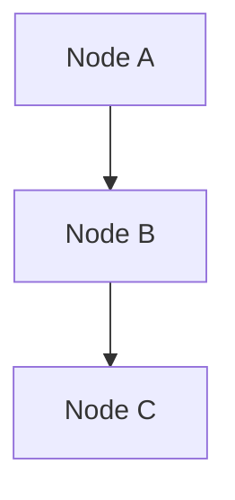

# PocketFlow 应用案例 (Application Cases)

> **学习指南**：本章精选了 PocketFlow 的 12 个应用案例，从入门到进阶，覆盖聊天、RAG、Agent、批处理、并行等常见模式。每个案例都包含 Flow 架构图、核心代码和学习要点。

<CaseShowcase />

---

## 0. 案例地图：选择你的学习路径

不同背景的读者可以选择不同的入门路径：

<el-tabs type="border-card">
  <el-tab-pane label="零基础入门">

**推荐顺序**：聊天机器人 → 写作工作流 → RAG

这三个案例覆盖了 PocketFlow 的核心模式：链式调用、循环、条件分支、BatchNode。掌握它们，你就能构建大多数 LLM 应用。

  </el-tab-pane>
  <el-tab-pane label="想做 Agent">

**推荐顺序**：搜索 Agent → 多 Agent 协作 → Agent Skills → MCP 工具集成 → 智能体编程

Agent 的核心是"自主决策循环"。这五个案例从简单的工具调用，到多 Agent 协作，再到技能路由和标准化工具集成，最后学习系统化构建 Agent 的工程方法论。

  </el-tab-pane>
  <el-tab-pane label="关注性能">

**推荐顺序**：Map-Reduce 批处理 → 并行处理

BatchNode 和 AsyncParallelBatchNode 是 PocketFlow 处理性能问题的核心工具。这两个案例展示如何用简洁的代码获得数倍加速。

  </el-tab-pane>
  <el-tab-pane label="输出质量">

**推荐顺序**：结构化输出 → 思维链推理

这两个案例展示如何提升 LLM 输出的可靠性：结构化输出确保格式正确可解析，思维链推理提升逻辑推理的准确性。

  </el-tab-pane>
</el-tabs>

---

## 1. 聊天机器人 (ChatBot)

::: info 难度：入门 | 模式：链式 + 循环 | 关键词：对话历史、多轮对话
:::

### 1.1 架构

```
GetInput → CallLLM → SendReply
    ↑                     |
    └─── "continue" ──────┘
```

### 1.2 核心思路

聊天机器人是最基础的 LLM 应用，它的 Flow 只有三个节点：

1. **GetInput**：从用户获取输入，将其追加到 `shared["history"]`
2. **CallLLM**：拼接对话历史为 prompt，调用 LLM API
3. **SendReply**：输出回复，`post()` 返回 `"continue"` 跳回 GetInput

### 1.3 关键代码

```python
from pocketflow import Node, Flow

class GetInput(Node):
    def prep(self, shared):
        return shared.get("history", [])

    def exec(self, history):
        user_input = input("You: ")
        return user_input

    def post(self, shared, prep_res, exec_res):
        if exec_res.lower() == "quit":
            return "end"
        shared.setdefault("history", []).append(
            {"role": "user", "content": exec_res}
        )
        return "default"

class CallLLM(Node):
    def prep(self, shared):
        return shared["history"]

    def exec(self, history):
        # 调用你的 LLM API
        response = call_llm(history)
        return response

    def post(self, shared, prep_res, exec_res):
        shared["history"].append(
            {"role": "assistant", "content": exec_res}
        )
        shared["last_reply"] = exec_res

class SendReply(Node):
    def prep(self, shared):
        return shared["last_reply"]

    def exec(self, reply):
        print(f"AI: {reply}")
        return reply

    def post(self, shared, prep_res, exec_res):
        return "continue"

# 构建 Flow
get_input = GetInput()
call_llm = CallLLM()
send_reply = SendReply()

get_input >> call_llm >> send_reply
send_reply - "continue" >> get_input

flow = Flow(start=get_input)
flow.run({})
```

::: tip 学习要点
- **循环模式**：`send_reply - "continue" >> get_input` 实现多轮对话
- **shared 通信**：对话历史存在 `shared["history"]` 中
- **退出条件**：`get_input` 的 `post()` 返回 `"end"` 时无后继节点，Flow 结束
:::

---

## 2. 写作工作流 (Writing Workflow)

::: info 难度：入门 | 模式：链式 | 关键词：多步骤生成、内容流水线
:::

### 2.1 架构

```
Outline → WriteDraft → Polish
```

### 2.2 核心代码

```python
class OutlineNode(Node):
    def prep(self, shared):
        return shared["topic"]

    def exec(self, topic):
        prompt = f"为主题'{topic}'列出文章大纲（3-5 个章节）"
        return call_llm(prompt)

    def post(self, shared, prep_res, exec_res):
        shared["outline"] = exec_res

class WriteDraftNode(Node):
    def prep(self, shared):
        return shared["outline"]

    def exec(self, outline):
        prompt = f"根据以下大纲撰写完整文章：\n{outline}"
        return call_llm(prompt)

    def post(self, shared, prep_res, exec_res):
        shared["draft"] = exec_res

class PolishNode(Node):
    def prep(self, shared):
        return shared["draft"]

    def exec(self, draft):
        prompt = f"润色以下文章，使语言更流畅：\n{draft}"
        return call_llm(prompt)

    def post(self, shared, prep_res, exec_res):
        shared["final_article"] = exec_res

outline = OutlineNode()
write_draft = WriteDraftNode()
polish = PolishNode()

outline >> write_draft >> polish
flow = Flow(start=outline)
flow.run({"topic": "PocketFlow 入门指南"})
```

::: tip 学习要点
- **最简链式模式**：三个节点顺序执行，每个节点做一件事
- **任务分解原则**：复杂任务拆分为小步骤，每步用一个 Node 处理
- **不要过度拆分**：太细的拆分会导致节点间上下文不连贯
:::

---

## 3. RAG 检索增强生成

::: info 难度：入门 | 模式：链式 + BatchNode | 关键词：向量检索、知识库
:::

### 3.1 架构

```
离线索引：Chunk → Embed → Index
在线查询：Retrieve → Generate
```

### 3.2 核心思路

RAG 分两个阶段：

**离线阶段**（构建索引）：
1. **Chunk**：将文档切分成小片段
2. **Embed**：使用 BatchNode 批量计算向量
3. **Index**：存入向量数据库

**在线阶段**（回答问题）：
1. **Retrieve**：根据问题检索相关片段
2. **Generate**：将检索到的 context 和 question 拼接，调用 LLM

### 3.3 关键代码

```python
from pocketflow import Node, BatchNode, Flow

# ===== 离线阶段 =====

class ChunkNode(Node):
    def prep(self, shared):
        return shared["documents"]

    def exec(self, docs):
        chunks = []
        for doc in docs:
            chunks.extend(split_text(doc, chunk_size=500))
        return chunks

    def post(self, shared, prep_res, exec_res):
        shared["chunks"] = exec_res

class EmbedBatch(BatchNode):
    """使用 BatchNode 批量处理每个 chunk"""
    def prep(self, shared):
        return shared["chunks"]  # 返回列表

    def exec(self, chunk):
        # 每个 chunk 独立计算 embedding
        return compute_embedding(chunk)

    def post(self, shared, prep_res, exec_res):
        shared["embeddings"] = exec_res  # 所有结果的列表

class IndexNode(Node):
    """将 chunk 与 embedding 配对存入索引"""
    def prep(self, shared):
        return {
            "chunks": shared["chunks"],
            "embeddings": shared["embeddings"],
        }

    def exec(self, data):
        # 构建索引（实际场景使用向量数据库）
        index = list(zip(data["chunks"], data["embeddings"]))
        return index

    def post(self, shared, prep_res, exec_res):
        shared["index"] = exec_res

# ===== 在线阶段 =====

class RetrieveNode(Node):
    def prep(self, shared):
        return shared["question"]

    def exec(self, question):
        q_embedding = compute_embedding(question)
        top_k = vector_search(q_embedding, k=3)
        return top_k

    def post(self, shared, prep_res, exec_res):
        shared["context"] = "\n".join(exec_res)

class GenerateNode(Node):
    def prep(self, shared):
        return {
            "context": shared["context"],
            "question": shared["question"]
        }

    def exec(self, data):
        prompt = f"""基于以下信息回答问题：
{data['context']}

问题：{data['question']}"""
        return call_llm(prompt)

    def post(self, shared, prep_res, exec_res):
        shared["answer"] = exec_res
        print(f"Answer: {exec_res}")

# 构建离线 Flow
chunk = ChunkNode()
embed = EmbedBatch()
index = IndexNode()
chunk >> embed >> index
offline_flow = Flow(start=chunk)

# 构建在线 Flow
retrieve = RetrieveNode()
generate = GenerateNode()
retrieve >> generate
online_flow = Flow(start=retrieve)
```

::: tip 学习要点
- **BatchNode**：`EmbedBatch` 的 `prep()` 返回列表，`exec()` 对每个 chunk 独立执行
- **两条 Flow**：离线索引和在线查询是独立的 Flow，共享同一个向量数据库
- **三节点离线流水线**：Chunk → Embed → Index 完整覆盖索引构建过程
:::

---

## 4. 搜索 Agent

::: info 难度：中级 | 模式：循环 + 条件分支 | 关键词：工具调用、自主决策
:::

### 4.1 架构

```
Think → Search
  ↑        |
  |   "need_more"
  └────────┘
       |
  "enough"
       ↓
  Synthesize
```

### 4.2 核心代码

```python
class ThinkNode(Node):
    def prep(self, shared):
        return {
            "question": shared["question"],
            "search_results": shared.get("search_results", [])
        }

    def exec(self, data):
        prompt = f"""问题：{data['question']}
已有信息：{data['search_results']}
请决定：还需要搜索什么？输出搜索关键词，或输出 ENOUGH 表示信息充分。"""
        return call_llm(prompt)

    def post(self, shared, prep_res, exec_res):
        if "ENOUGH" in exec_res:
            return "enough"
        shared["search_query"] = exec_res
        return "need_more"

class SearchNode(Node):
    def prep(self, shared):
        return shared["search_query"]

    def exec(self, query):
        return web_search(query)  # 调用搜索 API

    def post(self, shared, prep_res, exec_res):
        shared.setdefault("search_results", []).extend(exec_res)

class SynthesizeNode(Node):
    def prep(self, shared):
        return {
            "question": shared["question"],
            "results": shared["search_results"]
        }

    def exec(self, data):
        prompt = f"基于以下搜索结果回答问题...\n{data}"
        return call_llm(prompt)

# 构建 Flow
think = ThinkNode()
search = SearchNode()
synthesize = SynthesizeNode()

think - "need_more" >> search        # 信息不足则继续搜索
think - "enough" >> synthesize       # 信息充分则生成
search >> think                      # 搜索后回到思考

flow = Flow(start=think)
flow.run({"question": "PocketFlow 和 LangChain 有什么区别？"})
```

### 4.3 Agent 设计最佳实践

构建高性能 Agent 时，以下原则至关重要：

**上下文管理**：向 LLM 提供**相关且精简**的上下文，而非全量信息。LLM 在处理过长文本时容易"迷失在中间"（lost in the middle），应该用 RAG 检索相关片段而非直接塞入完整历史。

**动作空间设计**：每个 action 应**结构清晰、含义明确**，避免语义重叠。例如，不要同时定义 `search_database` 和 `query_csv` —— 应该合并为统一的 `search_data(source, query)` 接口。

**渐进式信息展示**：不要一次性展示全部信息。先给 LLM 概览（目录、摘要），让它选择要深入的部分。每次最多输入约 500 行内容。

**参数化动作**：让 action 通过参数灵活化。例如 `search_data(query="...", source="db")` 比固定的 `search_database` 和 `search_csv` 更灵活通用。

**错误恢复**：支持**回退**操作，让 Agent 能撤销失败的步骤。部分回退比完全重启更高效。

::: tip 学习要点
- **Agent 核心模式**：Think → Act → Observe 的循环
- **自主决策**：LLM 在 `exec()` 中判断是否需要更多信息
- **工具调用**：`SearchNode.exec()` 调用外部搜索 API
:::

---

## 5. 多 Agent 协作

::: info 难度：中级 | 模式：AsyncNode + 消息队列 + 并发 | 关键词：异步通信、协作博弈
:::

### 5.1 场景

Taboo 猜词游戏：一个 Agent 描述词语（不能说出关键词），另一个 Agent 猜词。两个 Agent 通过**异步消息队列**通信，使用 `asyncio.gather()` **并发运行**。

### 5.2 架构

```
HinterAgent ←──── asyncio.Queue ────→ GuesserAgent
   ↻ "continue"                          ↻ "continue"
         └───── asyncio.gather() ──────────┘
```

### 5.3 核心代码

```python
import asyncio
from pocketflow import AsyncNode, AsyncFlow

class HinterAgent(AsyncNode):
    """提示者：描述目标词，不能使用禁忌词"""
    async def prep_async(self, shared):
        msg = await shared["hinter_queue"].get()  # 等待消息
        return {
            "msg": msg,
            "word": shared["word"],
            "taboo_words": shared["taboo_words"],
        }

    async def exec_async(self, data):
        if data["msg"] == "start":
            prompt = f"请描述'{data['word']}'，不能使用：{data['taboo_words']}"
        else:
            prompt = f"对方猜的是'{data['msg']}'，不对。换个方式描述'{data['word']}'，不能使用：{data['taboo_words']}"
        return await async_call_llm(prompt)

    async def post_async(self, shared, prep_res, exec_res):
        await shared["guesser_queue"].put(exec_res)  # 发送提示给猜测者
        if shared.get("game_over"):
            return "end"
        return "continue"

class GuesserAgent(AsyncNode):
    """猜测者：根据提示猜词"""
    async def prep_async(self, shared):
        hint = await shared["guesser_queue"].get()  # 等待提示
        return hint

    async def exec_async(self, hint):
        prompt = f"根据以下描述猜一个词：{hint}"
        return await async_call_llm(prompt)

    async def post_async(self, shared, prep_res, exec_res):
        if exec_res.strip() == shared["word"]:
            shared["game_over"] = True
            print(f"猜对了！答案是「{shared['word']}」")
            return "end"
        shared["round"] = shared.get("round", 0) + 1
        if shared["round"] >= 5:
            shared["game_over"] = True
            print(f"超过 5 轮，游戏结束。答案是「{shared['word']}」")
            return "end"
        await shared["hinter_queue"].put(exec_res)  # 告诉提示者猜错了
        return "continue"

# 每个 Agent 自循环
hinter = HinterAgent()
hinter - "continue" >> hinter
hinter_flow = AsyncFlow(start=hinter)

guesser = GuesserAgent()
guesser - "continue" >> guesser
guesser_flow = AsyncFlow(start=guesser)

# 两个 Agent 并发运行
async def main():
    shared = {
        "word": "大熊猫",
        "taboo_words": ["熊猫", "国宝", "黑白"],
        "hinter_queue": asyncio.Queue(),
        "guesser_queue": asyncio.Queue(),
    }
    shared["hinter_queue"].put_nowait("start")  # 启动信号

    await asyncio.gather(
        hinter_flow.run_async(shared),
        guesser_flow.run_async(shared),
    )

asyncio.run(main())
```

::: tip 学习要点
- **AsyncNode**：使用 `prep_async` / `exec_async` / `post_async` 异步三阶段
- **消息队列**：`asyncio.Queue` 实现 Agent 间的异步通信
- **并发执行**：`asyncio.gather()` 让两个 Agent 同时运行，通过队列协调
- **自循环**：`agent - "continue" >> agent` 实现 Agent 的持续运行循环
- **AsyncFlow**：AsyncNode **必须**包裹在 AsyncFlow 中，不能用普通 Flow
:::

---

## 6. Map-Reduce 批处理

::: info 难度：入门 | 模式：BatchNode | 关键词：批量评估、数据聚合
:::

```python
class EvalResume(BatchNode):
    """批量评估简历"""
    def prep(self, shared):
        return shared["resumes"]  # 返回简历列表

    def exec(self, resume):
        # 每份简历独立评分
        prompt = f"请为以下简历评分(1-10)：\n{resume}"
        score = call_llm(prompt)
        return {"resume": resume, "score": int(score)}

    def post(self, shared, prep_res, exec_res):
        # exec_res 是所有评分结果的列表
        shared["scores"] = sorted(exec_res, key=lambda x: x["score"], reverse=True)
        print(f"Top 3: {shared['scores'][:3]}")
```

::: tip 学习要点
- `prep()` 返回列表 → `exec()` 对每个元素独立执行 → `post()` 收到结果列表
- 每个元素的 `exec()` 都有独立的重试机制
- 代码量与处理单个元素几乎完全相同
:::

---

## 7. 并行处理 (8x 加速)

::: info 难度：中级 | 模式：AsyncParallelBatchNode | 关键词：并发、I/O 密集
:::

```python
import asyncio
from pocketflow import AsyncParallelBatchNode, AsyncFlow

class ParallelProcess(AsyncParallelBatchNode):
    async def prep_async(self, shared):
        return shared["items"]

    async def exec_async(self, item):
        # 每个 item 并发执行
        result = await async_api_call(item)
        return result

    async def post_async(self, shared, prep_res, exec_res):
        shared["results"] = exec_res

# asyncio.gather() 自动并发所有 item
# I/O 密集场景下可获得 N 倍加速
```

---

## 8. 结构化输出 (Structured Output)

::: info 难度：中级 | 模式：循环 + 重试 + 校验 | 关键词：JSON 解析、格式验证、可靠输出
:::

### 8.1 架构

```
Generate → Validate → Check
                        |
              "retry" ──┘  "done" → Output
```

### 8.2 核心思路

LLM 的输出是自由文本，但下游系统往往需要**结构化数据**（JSON、表格、特定格式）。核心挑战是：LLM 可能输出格式不对的内容。解决方案：**生成 → 解析校验 → 不对就重来**。

### 8.3 关键代码

```python
import json
import re
from pocketflow import Node, Flow

class GenerateJSON(Node):
    def prep(self, shared):
        return shared["task"]

    def exec(self, task):
        prompt = f"""请为以下任务生成严格的 JSON 格式结果：
{task}

输出格式：{{"name": "...", "score": 0-100, "reason": "..."}}
只输出 JSON，不要其他文字。"""
        return call_llm(prompt)

    def post(self, shared, prep_res, exec_res):
        shared["raw_output"] = exec_res

class ValidateJSON(Node):
    """解析并校验 JSON 格式，利用 max_retries 自动重试解析"""
    def prep(self, shared):
        return shared["raw_output"]

    def exec(self, raw):
        # 提取 JSON 部分
        match = re.search(r'\{.*\}', raw, re.DOTALL)
        if not match:
            raise ValueError("输出中未找到 JSON")
        data = json.loads(match.group())
        # 校验必需字段和类型
        assert "name" in data, "缺少 name 字段"
        assert "score" in data, "缺少 score 字段"
        assert isinstance(data["score"], (int, float)), "score 必须是数字"
        assert 0 <= data["score"] <= 100, "score 必须在 0-100 之间"
        return data

    def exec_fallback(self, prep_res, exc):
        # 解析失败，返回 None 触发重新生成
        print(f"解析失败：{exc}")
        return None

    def post(self, shared, prep_res, exec_res):
        shared["result"] = exec_res  # 写入解析结果（成功为 dict，失败为 None）

class CheckResult(Node):
    def prep(self, shared):
        return shared.get("result")

    def post(self, shared, prep_res, exec_res):
        if shared.get("result") is None:
            shared["retry_count"] = shared.get("retry_count", 0) + 1
            if shared["retry_count"] >= 3:
                return "give_up"
            return "retry"       # 解析失败，让 LLM 重新生成
        return "done"

# 构建 Flow
generate = GenerateJSON()
validate = ValidateJSON(max_retries=2)  # 解析本身可重试 2 次
check = CheckResult()
output = Node()  # 占位输出节点

generate >> validate >> check
check - "retry" >> generate      # 格式不对，重新生成
check - "done" >> output         # 格式正确，输出结果
check - "give_up" >> output      # 多次失败，放弃

flow = Flow(start=generate)
flow.run({"task": "评估候选人张三的 Python 编程能力"})
```

::: tip 学习要点
- **双层重试**：`ValidateJSON(max_retries=2)` 在节点内重试解析，`check - "retry" >> generate` 在 Flow 层重试生成
- **exec_fallback**：解析失败时不抛异常，而是返回 `None` 让后续节点决策
- **防御性解析**：用正则提取 JSON、逐字段校验，应对 LLM 输出的不确定性
- **退出条件**：设置最大重试次数，避免无限循环
:::

---

## 9. 思维链推理 (Chain-of-Thought)

::: info 难度：进阶 | 模式：循环 + 自检 | 关键词：分步推理、自我验证、复杂问题求解
:::

### 9.1 架构

```
StepReason → Verify
    ↑          │ │
    │  "error" ─┘ │
    │  "continue"─┘
    │              "ok"
    │               ↓
    └────────   Conclude
```

### 9.2 核心思路

复杂问题（数学、逻辑、多步规划）直接让 LLM 一步回答容易出错。解决方案：**分步推理，每步验证**。

1. **StepReason**：每次只推理一步，追加到推理链
2. **Verify**：检查最新一步是否正确，不正确则回退重推
3. **Conclude**：推理完成后，整合所有步骤给出最终答案

### 9.3 关键代码

```python
from pocketflow import Node, Flow

class StepReason(Node):
    def prep(self, shared):
        return {
            "question": shared["question"],
            "steps": shared.get("steps", []),
        }

    def exec(self, data):
        prompt = f"""问题：{data['question']}
已有推理步骤：{data['steps']}
请继续推理下一步，输出格式：
STEP: [推理过程]
ANSWER: [如果已得出最终答案]"""
        return call_llm(prompt)

    def post(self, shared, prep_res, exec_res):
        shared.setdefault("steps", []).append(exec_res)
        shared["latest_step"] = exec_res

class Verify(Node):
    def prep(self, shared):
        return {
            "steps": shared["steps"],
            "latest_step": shared["latest_step"],
        }

    def exec(self, data):
        prompt = f"请验证以下推理是否正确：\n{data['steps']}\n如果有错误请指出。"
        return call_llm(prompt)

    def post(self, shared, prep_res, exec_res):
        if "错误" in exec_res:
            shared["steps"].pop()       # 移除错误的步骤
            return "error"              # 回退重推
        if "ANSWER" in shared.get("latest_step", ""):
            return "ok"                 # 已得出答案
        return "continue"               # 正确但未完成

class Conclude(Node):
    def prep(self, shared):
        return shared["steps"]

    def exec(self, steps):
        prompt = f"基于以下推理步骤，给出最终答案：\n{steps}"
        return call_llm(prompt)

    def post(self, shared, prep_res, exec_res):
        shared["answer"] = exec_res

# 构建 Flow
step_reason = StepReason()
verify = Verify()
conclude = Conclude()

step_reason >> verify
verify - "error" >> step_reason     # 发现错误，重推
verify - "continue" >> step_reason  # 继续推理下一步
verify - "ok" >> conclude           # 验证通过，输出

flow = Flow(start=step_reason)
flow.run({"question": "一个水池有 A、B 两个进水管，A 管 4 小时注满，B 管 6 小时注满，同时开两管几小时注满？"})
```

::: tip 学习要点
- **分步推理**：每次只推理一步，降低单步出错概率
- **自我验证**：Verify 节点检查推理正确性，错误则回退
- **步骤管理**：`shared["steps"]` 列表记录完整推理链，验证失败时 `pop()` 回退
- **与结构化输出的区别**：结构化输出校验**格式**，思维链校验**逻辑**
:::

---

## 10. MCP 工具集成

::: info 难度：进阶 | 模式：Agent + 工具 | 关键词：MCP 协议、标准化工具调用、扩展能力
:::

### 10.1 架构

```
SelectTool → ExecuteTool → Reflect
    ↑                         │
    └──── "continue" ─────────┘
                              │ "done"
                              ▼
                           Output
```

### 10.2 核心思路

Model Context Protocol (MCP) 是一种标准化的工具调用协议 —— 让 LLM 能以统一的方式调用各种外部工具（搜索、数据库、文件系统等）。PocketFlow 通过 Node 的 `exec()` 方法自然地集成 MCP 工具。

> **入门推荐**：[MCP Lite Dev 教程](https://datawhalechina.github.io/mcp-lite-dev) 提供了详细的 MCP 协议学习指南和最佳实践。

### 10.3 关键代码

```python
from pocketflow import Node, Flow

class SelectTool(Node):
    """让 LLM 从可用工具中选择最合适的"""
    def prep(self, shared):
        return {
            "task": shared["task"],
            "results": shared.get("results", []),
        }

    def exec(self, data):
        available_tools = get_mcp_tools()  # 获取 MCP 工具列表
        prompt = f"任务：{data['task']}\n已有结果：{data['results']}\n可用工具：{available_tools}\n请选择工具并指定参数。"
        return call_llm(prompt)

    def post(self, shared, prep_res, exec_res):
        shared["tool_call"] = exec_res

class ExecuteTool(Node):
    """通过 MCP 协议调用选中的工具"""
    def prep(self, shared):
        return shared["tool_call"]

    def exec(self, tool_call):
        return mcp_execute(tool_call)  # MCP 标准调用

    def post(self, shared, prep_res, exec_res):
        shared.setdefault("results", []).append(exec_res)

class Reflect(Node):
    """判断任务是否完成"""
    def prep(self, shared):
        return {
            "task": shared["task"],
            "results": shared["results"],
        }

    def exec(self, data):
        prompt = f"任务：{data['task']}\n已获得：{data['results']}\n任务完成了吗？输出 DONE 或 CONTINUE。"
        return call_llm(prompt)

    def post(self, shared, prep_res, exec_res):
        if "DONE" in exec_res:
            shared["answer"] = exec_res
            return "done"
        return "continue"

# 构建 Flow
select_tool = SelectTool()
execute_tool = ExecuteTool()
reflect = Reflect()
output = Node()  # 占位输出节点

select_tool >> execute_tool >> reflect
reflect - "continue" >> select_tool  # 还需要更多工具
reflect - "done" >> output           # 任务完成

flow = Flow(start=select_tool)
flow.run({"task": "查询北京今天的天气并生成播报文案"})
```

::: tip 学习要点
- **MCP 是协议，不是工具**：它定义了"如何调用工具"的标准，具体有哪些工具由你的 MCP 服务器决定
- **与搜索 Agent 的区别**：搜索 Agent 只有一个工具（搜索），MCP Agent 可以选择多种工具
- **Reflect 节点**：Agent 每次使用工具后反思是否已完成任务，避免不必要的额外调用
- **`get_mcp_tools()` 和 `mcp_execute()`**：这两个是你的工具函数（参见[原理篇 §6](../pocketflow-intro/#_6-工具函数层-node-里装什么)），具体实现取决于你连接的 MCP 服务器
:::

---

## 11. 智能体编程 (Agentic Coding)

::: info 难度：进阶 | 模式：人类设计 + 代理实现 | 关键词：系统设计、数据契约、可靠性
:::

智能体编程是一种高效协作范式：**人类负责系统设计，AI 负责实现**。PocketFlow 的核心抽象（Node / Flow / Shared Store）让这种协作更自然。

::: warning 重要提醒
如果你正在用 AI 构建 LLM 系统，请务必牢记三件事：
1) 从**小而简单**的方案开始；2) **先写高层设计文档**（例如 `docs/design.md`）再写代码；3) 频繁向人类确认与复盘。
:::

> **官方指南**：[Agentic Coding: Humans Design, Agents Code](https://the-pocket.github.io/PocketFlow/guide.html#agentic-coding-humans-design-agents-code)

### 11.1 分工原则（谁负责什么）

| 步骤 | 人类参与度 | AI 参与度 | 关键目标 |
| --- | --- | --- | --- |
| 1. 需求澄清 | 高 | 低 | 明确用户问题与价值边界 |
| 2. Flow 设计 | 中 | 中 | 用节点描述高层流程 |
| 3. Utilities | 中 | 中 | 列出外部能力/接口 |
| 4. Data 设计 | 低 | 高 | 设计 shared 数据契约 |
| 5. Node 设计 | 低 | 高 | 明确每个节点读写 |
| 6. 实现 | 低 | 高 | 让 Agent 写代码 |
| 7. 优化 | 中 | 中 | 调整拆分与提示词 |
| 8. 可靠性 | 低 | 高 | 补测试、补校验 |

### 11.2 8 步流程（写在设计文档里）

1. **Requirements**：明确需求，判断是否适合用 AI 解决
   - **适合**：重复性、规则清晰的任务（填表、邮件回复）
   - **适合**：输入明确的创作任务（生成文案、写 SQL）
   - **不适合**：高度模糊且需复杂决策的问题（商业战略、公司治理）
   - **以用户为中心**：先写"用户问题"，再写"功能清单"
   - **复杂度与价值平衡**：优先交付高价值、低复杂度能力

2. **Flow**：用节点描述系统如何协作
   - 识别设计模式：
     - [Map Reduce](https://the-pocket.github.io/PocketFlow/design_pattern/mapreduce.html)
     - [Agent](https://the-pocket.github.io/PocketFlow/design_pattern/agent.html)
     - [RAG](https://the-pocket.github.io/PocketFlow/design_pattern/rag.html)
   - 每个节点写一句话职责
   - 如果是 Map-Reduce：说明"拆分"和"聚合"
   - 如果是 Agent：说明"上下文"和"行动空间"
   - 如果是 RAG：说明"离线索引"和"在线检索"
   - 画流程图（示例）：

   ```mermaid
   flowchart LR
       start[Start] --> batch[Batch]
       batch --> check[Check]
       check -->|OK| process
       check -->|Error| fix[Fix]
       fix --> check

       subgraph process[Process]
         step1[Step 1] --> step2[Step 2]
       end

       process --> endNode[End]
   ```

   ::: tip
   如果人类无法画出 Flow，AI 就无法自动化。建议先手动解几条样例，建立直觉。
   :::

3. **Utilities**：识别并实现外部工具（系统的"身体"）
   - 读取输入：拉取消息、读文件、查数据库
   - 写入输出：发送通知、生成报告
   - 调用外部工具：搜索、API、数据库、LLM
   - **注意**：LLM 内部任务（总结、分析）不是 Utility

   <div align="center"></div>

   - 为每个 Utility 写一个小测试并记录输入输出
   - 示例记录：
     - `name`: `get_embedding` (`utils/get_embedding.py`)
     - `input`: `str`
     - `output`: 3072 维向量
     - `necessity`: 第二个节点需要 embedding

4. **Data**：设计 shared 数据契约
   - 小系统用内存字典；大系统可接数据库
   - **避免重复**：引用或外键优先

   ```python
   shared = {
       "user": {
           "id": "user123",
           "context": {
               "weather": {"temp": 72, "condition": "sunny"},
               "location": "San Francisco"
           }
       },
       "results": {}
   }
   ```

5. **Node**：写清每个节点读写与工具依赖
   - `type`：Regular / Batch / Async
   - `prep`：读 shared 的什么字段
   - `exec`：调用哪个 Utility（不写异常处理）
   - `post`：写回 shared 的什么字段

6. **Implementation**：开始让 Agent 写代码
   - **Keep it simple**：不要一上来就追求复杂特性
   - **Fail fast**：用 Node 的重试/回退机制快速暴露薄弱环节
   - 添加足够日志，方便调试

7. **Optimization**：再迭代
   - 先用直觉做快评估
   - 回到步骤 3–6 重新拆分与优化
   - 提示词更清晰、加入示例减少歧义

8. **Reliability**：补齐稳定性
   - `exec` 内增加结果校验
   - 适当提升 `max_retries` 和 `wait`
   - 加入"自评估节点"对结果做二次检查

   <div align="center"></div>

### 11.3 最小设计文档模板（节选）

~~~markdown
# Design Doc: 项目名

## Requirements
- 用户要解决的具体问题：
- 成功标准：

## Flow Design
- 节点列表与一句话说明



## Utilities
- call_llm(prompt: str) -> str
- search_web(query: str) -> list

## Data (shared)
shared = {
  "input": ...,  # 原始输入
  "context": ...,
  "answer": ...
}

## Node Design
- Node A: prep 读 input，exec 调用工具，post 写 context
- Node B: ...
~~~

### 11.4 示例工程结构

```
my_project/
├── main.py
├── nodes.py
├── flow.py
├── utils/
│   ├── __init__.py
│   ├── call_llm.py
│   └── search_web.py
├── requirements.txt
└── docs/
     └── design.md
```

### 11.5 Utilities 实战代码（可直接运行）

```python
# utils/call_llm.py
import os
from openai import OpenAI

def call_llm(prompt: str) -> str:
    client = OpenAI(api_key=os.getenv("OPENAI_API_KEY", ""))
    r = client.chat.completions.create(
        model=os.getenv("OPENAI_MODEL", "gpt-4o-mini"),
        messages=[{"role": "user", "content": prompt}]
    )
    return r.choices[0].message.content

if __name__ == "__main__":
    print(call_llm("用一句话解释 PocketFlow"))
```

```python
# utils/search_web.py
import requests

def search_web(query: str) -> list[str]:
    # 伪实现：请替换为你的搜索 API
    url = "https://api.example.com/search"
    r = requests.get(url, params={"q": query}, timeout=10)
    r.raise_for_status()
    data = r.json()
    return [item["snippet"] for item in data.get("items", [])]

if __name__ == "__main__":
    print(search_web("PocketFlow agentic coding"))
```

### 11.6 Node/Flow/Main 实战代码

```python
# nodes.py
from pocketflow import Node
from utils.call_llm import call_llm
from utils.search_web import search_web

class DecideAction(Node):
    def prep(self, shared):
        return shared["question"], shared.get("context", [])

    def exec(self, data):
        question, context = data
        prompt = f"""问题：{question}
已有信息：{context}
请决定下一步：SEARCH 或 ANSWER。"""
        return call_llm(prompt)

    def post(self, shared, prep_res, exec_res):
        if "SEARCH" in exec_res:
            return "search"
        return "answer"

class Search(Node):
    def prep(self, shared):
        return shared["question"]

    def exec(self, question):
        return search_web(question)

    def post(self, shared, prep_res, exec_res):
        shared.setdefault("context", []).extend(exec_res)

class Answer(Node):
    def prep(self, shared):
        return shared["question"], shared.get("context", [])

    def exec(self, data):
        question, context = data
        prompt = f"""请基于以下信息回答问题：
{context}

问题：{question}"""
        return call_llm(prompt)

    def post(self, shared, prep_res, exec_res):
        shared["answer"] = exec_res
```

```python
# flow.py
from pocketflow import Flow
from nodes import DecideAction, Search, Answer

def create_agent_flow():
    decide = DecideAction()
    search = Search()
    answer = Answer()

    decide - "search" >> search
    decide - "answer" >> answer
    search >> decide  # 搜索后回到判断

    return Flow(start=decide)
```

```python
# main.py
from flow import create_agent_flow

def main():
    shared = {"question": "PocketFlow 有哪些设计模式？"}
    flow = create_agent_flow()
    flow.run(shared)
    print("Answer:", shared.get("answer"))

if __name__ == "__main__":
    main()
```

### 11.7 可靠性增强（重试 + 回退）

```python
from pocketflow import Node
from utils.call_llm import call_llm

class SafeAnswer(Node):
    def exec(self, question):
        if not question:
            raise ValueError("empty question")
        return call_llm(question)

    def exec_fallback(self, prep_res, exc):
        return "抱歉，当前无法生成答案，请稍后再试。"

safe_answer = SafeAnswer(max_retries=3, wait=2)
```

### 11.8 最小可运行测试

```python
# tests/test_nodes.py
from nodes import DecideAction

def test_decide_action_returns_string():
    node = DecideAction()
    shared = {"question": "What is PocketFlow?"}
    action = node.run(shared)
    assert action in ["search", "answer", "default"]
```

::: tip 学习要点
- 智能体编程的核心不是"让 AI 写代码"，而是**让 AI 严格按设计实现**
- 设计文档越清晰，Flow 的可维护性与稳定性越高
- 可靠性靠"检查 + 重试 + 评估节点"来补齐
:::

---

## 12. Agent Skills (技能路由)

::: info 难度：中级 | 模式：链式 + 条件路由 | 关键词：技能文件、动态 Prompt、模块化知识
:::

Agent Skills 是一种将**领域知识模块化为独立文件**的模式。Agent 根据用户请求动态选择技能，将技能指令注入 LLM prompt，实现"一个 Agent，多种能力"。

> **核心思路**：技能 = Markdown 文件，选择技能 = 路由节点，执行技能 = Prompt 注入。

### 12.1 问题场景

你有一个通用 Agent，但需要处理多种不同类型的任务 —— 写摘要、列清单、做评审。如果为每种任务写一个独立的 Node 和 Flow，代码会迅速膨胀。

**Agent Skills 的解法**：把每种任务的指令写成一个 Markdown 文件（技能），Agent 在运行时根据用户输入**动态选择**并加载。

### 12.2 架构设计

```text
  用户请求
     │
     ▼
┌──────────┐    ┌──────────┐
│SelectSkill│──▶│ApplySkill│
│ 选择技能   │    │ 执行任务   │
└──────────┘    └──────────┘
     │                │
     │ 读取 skills/    │ 技能指令 + 用户请求
     │ 目录下的 .md    │ 拼入 LLM prompt
     ▼                ▼
 skills/           LLM 输出
 ├── executive_brief.md
 ├── checklist_writer.md
 └── code_reviewer.md
```

**两个节点**，职责清晰：
1. **SelectSkill**：列出所有可用技能，根据用户意图选择最匹配的一个
2. **ApplySkill**：读取选中技能的指令，拼入 prompt，调用 LLM 执行

### 12.3 技能文件示例

技能文件就是普通的 Markdown，包含指令和规则：

```markdown
<!-- skills/executive_brief.md -->
# 执行摘要技能
你正在为高管撰写摘要。
## 规则
- 保持简洁，面向决策
- 以 3 个要点开头
- 包含风险和建议的下一步行动
- 避免实现细节
```

```markdown
<!-- skills/checklist_writer.md -->
# 清单编写技能
将请求转换为清晰、可执行的清单。
## 规则
- 使用编号步骤
- 每步简短且可验证
- 标注依赖和阻塞项
- 以"完成标准"结尾
```

### 12.4 核心代码

```python
from pathlib import Path
from pocketflow import Node, Flow

def load_skills(skills_dir: str) -> dict:
    """从目录加载所有 .md 技能文件"""
    skills = {}
    for md_file in sorted(Path(skills_dir).glob("*.md")):
        skills[md_file.stem] = md_file.read_text(encoding="utf-8")
    return skills

class SelectSkill(Node):
    """根据用户任务选择最匹配的技能"""
    def prep(self, shared):
        return {
            "task": shared["task"],
            "skills": load_skills(shared.get("skills_dir", "./skills")),
        }

    def exec(self, data):
        skill_names = list(data["skills"].keys())
        # 让 LLM 根据任务描述选择最匹配的技能
        prompt = f"任务：{data['task']}\n可用技能：{skill_names}\n请返回最匹配的技能名。"
        selected = call_llm(prompt)  # 返回技能名字符串
        return selected, data["skills"].get(selected, "")

    def post(self, shared, prep_res, exec_res):
        skill_name, skill_content = exec_res
        shared["selected_skill"] = skill_name
        shared["skill_content"] = skill_content

class ApplySkill(Node):
    """将选中的技能注入 prompt 并执行任务"""
    def prep(self, shared):
        return {
            "task": shared["task"],
            "skill_name": shared["selected_skill"],
            "skill_content": shared["skill_content"],
        }

    def exec(self, data):
        prompt = f"""你正在执行一个 Agent Skill。
技能名：{data['skill_name']}
技能指令：
---
{data['skill_content']}
---
用户任务：{data['task']}
请严格按照技能指令完成任务。"""
        return call_llm(prompt)

    def post(self, shared, prep_res, exec_res):
        shared["result"] = exec_res

# 构建 Flow
select = SelectSkill()
apply = ApplySkill()
select >> apply
flow = Flow(start=select)

# 运行
shared = {"task": "总结 PocketFlow 的核心优势，给技术 VP 汇报用"}
flow.run(shared)
print(shared["result"])
```

### 12.5 为什么这个模式有价值？

| 传统做法 | Agent Skills |
| :--- | :--- |
| 每种任务写一个 Node 类 | 一个通用 Flow，技能文件即插即用 |
| 新增任务 = 改代码 | 新增任务 = 加一个 .md 文件 |
| 指令硬编码在 Python 中 | 指令与代码分离，非开发者也能维护 |
| 测试需要跑整个 Flow | 技能文件可以独立 review 和迭代 |

::: tip 学习要点
- 技能文件是**纯 Markdown**，不是代码 —— 产品经理、运营人员都能编写和维护
- SelectSkill 本身可以用 LLM 做路由（语义匹配），也可以用关键词规则（确定性路由）
- 这个模式可以和 Agent 循环组合：Agent 在每轮决策中选择不同的 Skill 来执行
- 详见 [原理篇 §6：工具函数层](../pocketflow-intro/#_6-工具函数层-node-里装什么) 了解 PocketFlow 的工具函数体系
:::

---

## 配套示例代码

本教程的所有案例都已整理为**完整可运行的 Python 脚本**，存放在 [`examples/`](https://github.com/zhimin-z/easy-pocket/tree/main/docs/zh-cn/pocketflow-cases/examples) 文件夹中。

### 环境配置

::: code-group

```bash [Windows]
python -m venv .venv
.venv\Scripts\activate
cd examples
pip install -r requirements.txt
```

```bash [macOS / Linux]
python -m venv .venv
source .venv/bin/activate
cd examples
pip install -r requirements.txt
```

:::

### 示例一览

| 文件 | 案例 | 核心模式 |
| :--- | :--- | :--- |
| `01_chatbot.py` | 1. 聊天机器人 | 链式 + 循环 |
| `02_writing_workflow.py` | 2. 写作工作流 | 链式 |
| `03_rag.py` | 3. RAG 检索增强 | 链式 + BatchNode |
| `04_search_agent.py` | 4. 搜索 Agent | 循环 + 条件分支 |
| `05_multi_agent.py` | 5. 多 Agent 协作 | AsyncNode + 消息队列 |
| `06_map_reduce.py` | 6. Map-Reduce | BatchNode |
| `07_parallel_processing.py` | 7. 并行处理 | AsyncParallelBatchNode |
| `08_structured_output.py` | 8. 结构化输出 | 循环 + 重试 + 校验 |
| `09_chain_of_thought.py` | 9. 思维链推理 | 循环 + 自检 |
| `10_mcp_tool.py` | 10. MCP 工具集成 | Agent + 工具 |
| `11_agentic_coding/` | 11. 智能体编程 | 完整项目模板 |
| `12_agent_skills.py` | 12. Agent Skills | 链式 + 条件路由 |

::: code-group

```bash [按学习路径运行]
# 零基础入门
python 01_chatbot.py
python 02_writing_workflow.py
python 03_rag.py

# Agent 方向
python 04_search_agent.py
python 05_multi_agent.py
python 12_agent_skills.py
python 10_mcp_tool.py
cd 11_agentic_coding && python main.py
```

```bash [运行单个示例]
python 04_search_agent.py
```

:::

::: info 关于示例代码
- 所有示例默认使用**模拟 LLM**，无需 API 密钥，开箱即用
- 如需接入真实 LLM，只需替换各文件中的 `mock_` 函数即可
- 案例 11 是完整的多文件项目模板，包含 utils / nodes / flow / tests
:::

---

## 总结

<el-card shadow="hover" style="border-radius: 16px; border: 2px dashed var(--vp-c-brand); margin: 20px 0;">
  <div style="text-align: center;">
    <div style="font-size: 1.25rem; font-weight: 600; color: var(--vp-c-text-1);">
      100 行代码，覆盖主流场景
    </div>
    <div style="color: var(--vp-c-text-3); margin-top: 0.5rem;">
      Node 做事，Flow 调度，shared 通信 —— 三个概念，构建一切。
    </div>
  </div>
</el-card>

### 下一步

- 回顾 [PocketFlow 原理入门](../pocketflow-intro/) 巩固核心概念
- 访问 [PocketFlow GitHub](https://github.com/The-Pocket/PocketFlow) 查看完整 cookbook
